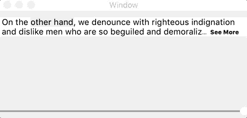

<p align="center">
    
    
    
    
    <a href="https://github.com/SergeBouts/SeeMoreTextView/blob/master/LICENSE">
        
    </a>
</p>

# SeeMoreTextView

**NSTextView/UITextView** subclass with an expandable **See More** link. It helps avoid cluttering with too much information, by hiding some of it, allowing users to choose whether to display the hidden information. The hidden information is displayed by clicking on the **See More** link.



## Advantages

The main advantage of **SeeMoreTextView** is that it preserves text model intact fully accomplishing its functionality with the layout manager.

## How

```swift
import SeeMoreTextView
...
var seeMoreTextView: SeeMoreTextView!
var scrollViewHeightConstraint: NSLayoutConstraint!

override func viewWillAppear() {
    super.viewWillAppear()

    seeMoreTextView = SeeMoreTextView(frame: .zero)
    seeMoreTextView.translatesAutoresizingMaskIntoConstraints = false
    
    let scrollView = NSScrollView()
    view.addSubview(scrollView)
    scrollView.translatesAutoresizingMaskIntoConstraints = false
    scrollView.borderType = .noBorder
    scrollView.hasVerticalScroller = true
    scrollView.hasHorizontalScroller = false
    scrollView.documentView = seeMoreTextView
    
    scrollViewHeightConstraint = scrollView.heightAnchor.constraint(equalToConstant: 0)

    seeMoreTextView.onHeightChange = { sender in
        self.scrollViewHeightConstraint.constant = min(sender.height, 100)
    }
    
    NSLayoutConstraint.activate([
        scrollView.centerXAnchor.constraint(equalTo: view.centerXAnchor),
        scrollView.topAnchor.constraint(equalTo: view.topAnchor, constant: 10),
        scrollViewHeightConstraint,
        scrollView.widthAnchor.constraint(equalTo: seeMoreTextView.widthAnchor),
        scrollView.widthAnchor.constraint(equalToConstant: 400),
    ])

    // Full text to display
    let str = "On the other hand, ...."
    seeMoreTextView.contents = NSAttributedString(string: str, attributes: [
            .font: NSFontManager.shared.font(withFamily: "Helvetica", traits: [], weight: 5, size: 14)!
        ])
    // Number of lines to display in collapsed state
    seeMoreTextView.collapsedLineCount = 2
}
```

## Installation

### Swift Package as dependency in Xcode 11+

1. Go to "File" -> "Swift Packages" -> "Add Package Dependency"
2. Paste Themer repository URL into the search field:

`https://github.com/SergeBouts/SeeMoreTextView.git`

3. Click "Next"

4. Ensure that the "Rules" field is set to something like this: "Version: Up To Next Major: 3.0.4"

5. Click "Next" to finish

For more info, check out [here](https://developer.apple.com/documentation/xcode/adding_package_dependencies_to_your_app).

### CocoaPods

[CocoaPods]: http://cocoapods.org

Add the following to your [Podfile](http://guides.cocoapods.org/using/the-podfile.html):

```ruby
platform :osx, '10.12'

target 'YOUR-TARGET' do
  use_frameworks!
  pod 'SeeMoreTextView', :git => 'https://github.com/SergeBouts/SeeMoreTextView.git'
end
```

Then run `pod install`.

## License

This project is licensed under the MIT license.
